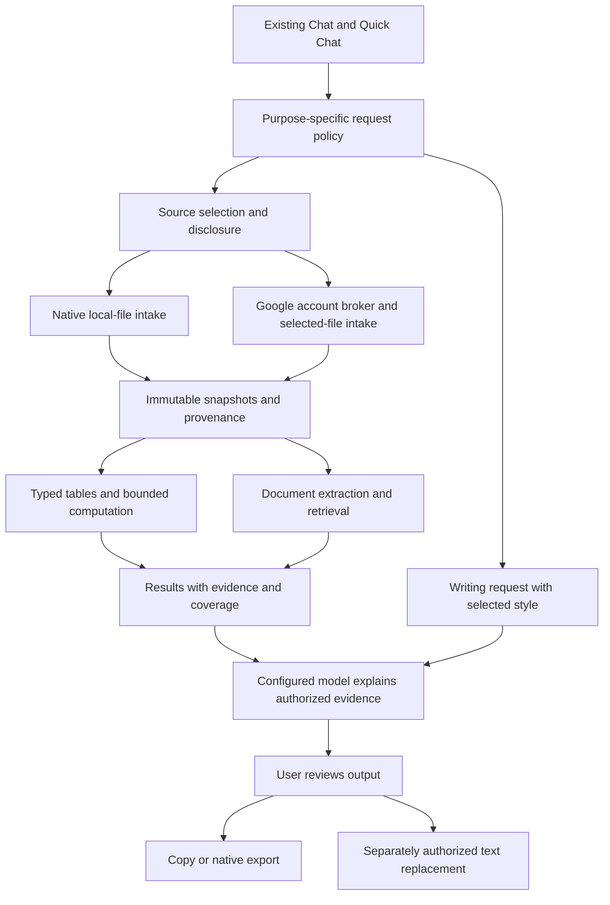

# Dependable Daily Copilot — Proposed Technical Design

**Date:** 2026-09-05  
**Status:** proposed for review; not an implementation authorization  
**Baseline:** `a2f72b45`  
**Roadmap:** [Dependable daily copilot](../../plans/260905-daily-copilot/plan.md)

## 1. Design principles

1. Extend existing chat, Quick Chat, model adapters, memory, account vault, and platform boundaries.
2. Separate writing, document retrieval, numerical computation, and desktop actions. They have different correctness and permission requirements.
3. Use one source snapshot and provenance contract across local and Google inputs.
4. Keep originals unchanged. Refresh and analysis produce new derived records.
5. Make incomplete extraction, unavailable tools, limits, stale sources, and failures visible.
6. Treat document text, spreadsheet cells, filenames, retrieved pages, and on-screen content as untrusted data.
7. Enforce authority in native code or the responsible broker, not through a prompt or renderer flag.

## 2. Approaches considered

| Approach | Advantages | Disadvantages | Recommendation |
| --- | --- | --- | --- |
| Prompts/skills on top of current chat only | Fast writing prototype; minimal architecture | Cannot ensure full-file arithmetic, snapshot provenance, or narrow desktop authority | Use to evaluate wording, not as the whole product |
| Dedicated workflows using existing shared infrastructure | Consistent experience, testable boundaries, incremental shipping | Requires explicit source/computation contracts | **Recommended** |
| General autonomous agent using shell/browser/MCP for everything | Broad flexibility | Permissions, setup, reliability, latency, and security burden; conflicts with workspace restrictions | Keep existing expert features separate; not the default |

### Computation alternatives

- **Bounded declarative operations compiled to a local engine:** recommended v1. Filter, projection, sort, aggregate, join, derived columns, and basic descriptive statistics can be validated before execution.
- **Model-generated SQL:** possible later only with structural validation and engine restrictions. A string beginning with `SELECT` is not a security boundary.
- **General Python runtime:** defer. More analytical breadth, but package management, resource isolation, platform support, and filesystem/network authority need a separate security design.

Evaluate a native columnar engine such as DuckDB against a smaller SQLite-based implementation in Phase 0. Prefer the simpler option that passes representative correctness, cancellation, resource, packaging, and licensing gates. The engine is not yet selected.

Do not equate this analysis runtime with the existing feasibility-gated Quick Local Run. Neither feature may enable the other or restore generic `execute_command`/`fs:*`.

## 3. Logical architecture

The model can propose an analysis operation through typed tools; the broker validates it and returns bounded results. It cannot obtain arbitrary host paths, credentials, or engine handles. The diagram shows logical responsibilities, not a requirement for a new process per box.

## 4. Code ownership and integration seams

Paths marked **proposed** do not exist yet and require the Phase 0 architecture decision.

| Responsibility | Existing seam / proposed location |
| --- | --- |
| Writing entry and result UI | [Quick Chat](../../src/renderer/routes/quick.tsx), existing main chat/composer; proposed `src/renderer/packages/writing/` |
| Global shortcut and capture transport | [Desktop shell](../../src-tauri/src/desktop_shell.rs); narrow broker rather than general computer tools |
| Request composition | [Generation](../../src/renderer/stores/session/generation.ts), [stream orchestration](../../src/renderer/packages/model-calls/stream-text.ts), provider-neutral adapters |
| Shared contracts | Existing `src/shared/types/`; proposed `analysis.ts` and `writing.ts` with Zod validation |
| Analysis UI orchestration | Proposed `src/renderer/packages/analysis/`; components in the existing conversation surface |
| Native intake, snapshots, jobs, execution | Proposed `src-tauri/src/analysis/`, dispatched by existing `ipc_invoke` in `src-tauri/src/lib.rs` |
| Platform contract | [Platform interface](../../src/renderer/platform/interfaces.ts) plus desktop/web/test implementations with explicit unsupported states |
| Google metadata and token lifecycle | [Integrations](../integrations.md); reuse account resolution, vault, and refresh mutex |
| Document retrieval | [KB](../rag.md) parsing/retrieval primitives where suitable; no assumption that current flattened chunks preserve page/table provenance |
| Preferences | [Existing memory](../memory.md) for explicitly saved facts; operational defaults in settings |

Use Zustand for persisted preferences, React Query for resource/job state, and existing local UI-state patterns. Do not store large tables in renderer atoms or a second authoritative metadata cache.

## 5. Request policies, not another agent framework

Define a small typed policy resolved before tools and prompts are assembled:

| Purpose | Context | Tools and side effects |
| --- | --- | --- |
| Writing | Current draft, explicit style settings, manually selected context | No web, file, task, image, memory-write, browser, MCP, or desktop tools by default |
| Data analysis | User-authorized source schemas, bounded samples/results, prior run context | Read-only snapshot tools and bounded computation; no external search by default |
| Document questions | Authorized excerpts and provenance | Retrieval/page lookup; optional web research requires explicit enablement |
| General chat | Existing session policy | Preserve existing behavior except separately approved reliability fixes |
| Text replacement | Exact reviewed text and native target ticket | One narrow user-triggered action; not a model-initiated typing loop |

Capabilities are decided once from provider support, purpose, platform, user authorization, and native readiness. Disabled tools cannot leak back through MCP, hooks, agents, or retry paths.

Writing must not inherit the previous Quick Chat conversation, source files, global memory injection, or auto-save as an accidental side effect. Reuse the provider/request transport but define an ephemeral request boundary. Saving a rewrite into a conversation is an explicit action.

No silent provider switch. A retry with another configured model must disclose the destination and require user choice, especially for private data.

## 6. Proposed minimal records

Do not create a general workflow scheduler or a separate universal memory domain.

| Record | Minimum fields / rule |
| --- | --- |
| `WritingPreferences` | Tone, English variant, preserve formatting, optional explicit domain terms; no inferred sensitive facts |
| `SourceSnapshot` | Opaque ID, owner session, origin, name, MIME, hash, byte size, capture time, optional connector account/file/version metadata, extraction state |
| `SourcePart` | Snapshot ID, sheet/range or page/paragraph locator, typed schema or text blocks, coverage warnings |
| `AnalysisRun` | Run ID, snapshot IDs, user question, authorized provider, engine/parser versions, validated operations, result references, completion state, warnings |
| `SavedAnalysis` | Title, source lineage, reusable recipe and parameters; refresh/rebinding always explicit |
| `ReplacementTicket` | Native-only identity, source app/window/control, selection revision/hash, short expiry, one-use state; renderer receives opaque ticket only |

Store derived structured tables and large artifacts behind native storage. Select one analysis metadata owner after lifecycle review; a dedicated app-owned database is the default proposal, not tables inserted casually into the KB schema.

Writing preferences do not require a new memory engine. Operational preferences belong in settings; explicit durable writing facts can use existing editable memory. Analysis recipes are reproducible records, not automatically extracted global facts.

## 7. Source intake and lifecycle

1. Local picker or supported attachment intake grants access only to the selected bytes. A pasted path or model-supplied file ID is not authorization.
2. Drive selection binds account, allowed file ID, and request owner. Tokens stay in the broker.
3. Stream bounded bytes into app-owned staging, validate actual format, enforce expansion/parse budgets, and publish an immutable snapshot atomically.
4. Parse into typed tables or document blocks; preserve source locators, omission reasons, parser version, and content hash.
5. Present schema/coverage and ambiguous conversions before consequential computation.
6. Authorize model disclosure: identify destination and content categories. Send schemas, approved samples, selected excerpts, and bounded results rather than entire files by default.
7. Execute read-only analysis and persist a completed result manifest only when all required operations succeed.
8. Export through a native destination picker, separate from read access.

Jobs use a shared state machine: `queued → importing → parsing → ready → analyzing → completed`, with `failed` and `cancelled` terminal states. Refresh starts a new import job. Partial evidence may be displayed as partial, never promoted to completed full-data analysis.

Cancellation must stop native work, network transfer, model streaming, and late-result publication. Startup recovery cleans incomplete staging and marks interrupted runs honestly.

Default proposal: writing drafts are ephemeral; analysis snapshots persist with explicitly saved analysis conversations. Unsaved analysis staging is cleaned after cancellation/session disposal or crash recovery. Define exact retention/migration rules in Phase 2 before enabling the feature.

Deleting a source invalidates dependent reruns and removes its parsed/indexed derivatives. Let the user separately delete derived answers/exports; explain that copies already exported, synced, or sent to a provider cannot be retracted. Do not enable snapshot sync by reusing ordinary chat sync accidentally.

## 8. Numerical correctness

- Preserve raw values alongside interpreted types; ambiguous IDs/dates/decimal separators require explicit conversion.
- Use decimal-safe operations for monetary values; define rounding and null handling in the recipe.
- Preserve leading-zero identifiers, timezone/date-system semantics, and mixed units/currencies.
- Present join keys and multiplicity; warn about many-to-many expansion.
- Never deduplicate, drop nulls, filter hidden rows, or remove outliers silently.
- Execute over the complete authorized dataset within supported limits. A preview is not a valid basis for whole-file totals.
- Excel formula cells use available cached values with freshness/availability warnings. Do not execute macros, external connections, or claim to recalculate arbitrary formulas.
- Render charts from computed tables, not model-invented values. Include units, filters, denominators, and a data-table alternative.
- Keep transformations reproducible. A natural-language paraphrase of a query is not the only calculation record.

## 9. Document evidence and OCR

Reuse document infrastructure only where its source coverage is sufficient. Text PDFs need page locators; DOCX needs paragraphs/headings/tables rather than invented page numbers.

Mixed/scanned PDFs must expose unreadable pages. OCR is a separate, explicit operation with provider/cost/data disclosure where remote processing is involved. Prefer a local path if it meets quality, packaging, and performance requirements.

Extracted PDF/DOCX tables are candidates, not trusted datasets. Require schema/value review and preserve page/region lineage before they enter the numerical engine. Mark uncertainty and reject calculations whose inputs cannot be established.

Document answers should distinguish quoted evidence, interpretation, and missing information. Retrieval of a few chunks must not support claims that every page was checked.

## 10. Computation and parser safety

- Expose a typed allowlist of operations; reject arbitrary code, SQL strings, file paths, URLs, and multi-statement commands in v1.
- Register only app-owned source tables with opaque IDs.
- Disable engine extension loading/install, network access, external scans, attach/import/export commands, and unneeded functions using actual engine controls.
- Compile validated operation trees into queries internally with quoted identifiers and bound values.
- Bound CPU/time, memory, temp disk, result size, concurrent jobs, and decompressed input size.
- Prove cancellation and resource limits in the chosen native hosting model. A worker thread alone is not a security sandbox.
- If hard termination/isolation needs a dedicated worker process, evaluate packaging and OS controls before approving the engine.
- Reject malformed archives, path traversal, archive bombs, active content, encrypted inputs, and unsupported legacy formats safely.
- Neutralize spreadsheet-formula injection in exports; preserve a documented safe-export policy.

## 11. Google access design and feasibility gates

Official Google guidance recommends per-file `drive.file` access with Google Picker. **That scope permits modification of selected files; it is not a read-only scope.** Enforce an allowlisted read-only API surface in the broker and accurately explain the permission.

Alternative: broad `drive.readonly` enables wider browsing/download but is a restricted scope with verification and potentially security-assessment implications. Do not request it merely for a convenient search box.

Phase 0 must prove Picker/desktop OAuth compatibility and permitted Sheets/Docs reads under the selected scope. If it fails, recommend an alternative explicitly; do not widen scopes automatically.

Public release requires a Chaeboxi-owned OAuth project/client configuration and a Google user-data policy review, including onward transfer of selected data to BYOK model providers. An embedded desktop client is not a safe place for a confidential client secret. BYO client configuration may support a developer alpha, but is not the target onboarding experience.

Use the existing account resolver and refresh lifecycle. Adding an analysis connection must not silently revoke or widen existing Google/MCP account permissions.

Snapshot handling:

- Blob files: bounded download after checking access/download capability.
- Sheets: use the validated API/export path; preserve sheet/range identity, typed/raw values, relevant formulas, and locale.
- Docs: supported bounded export with explicit omissions.
- Check metadata before and after acquisition where possible; retry/refuse if the file changed during capture.
- Multi-file snapshots are not a cross-file transaction. Record acquisition times and warn about temporal skew.
- Handle revocation, expired tokens, shared-file restrictions, quota/429, export limits, and offline mode without falling back to public scraping.

## 12. Desktop selection and replacement

Reuse shortcuts and permission onboarding, but do not grant Quick Chat general workspace authority.

Capture only on explicit user action. Do not poll the clipboard or upload its contents on window open. Prefer accessibility-selected text where available; manual paste/copy is always the safe fallback.

For replacement, native code must bind a short-lived ticket to the original editable control and exact selection. Revalidate process/window/control, focus, selected content, and expiry after the user reviews the rewrite. Reject password fields, unknown controls, changed text, ambiguous focus, stale tickets, and cross-window reuse.

Do not substitute simulated paste/Enter when replacement fails. Copy the result instead. Never send the message or change channel/recipient. Verify the result where supported; avoid automatic rollback that might overwrite a new user edit.

Existing broad computer-use approvals remain separate and default off for these workflows.

## 13. Operational constraints

- No new automatic telemetry. Local diagnostics exclude raw drafts, file contents, access tokens, URLs with credentials, and full queries containing private literals.
- Show model cost/usage when available; estimated cost is labeled as an estimate.
- Test permission denial, unavailable providers, offline use, cancellation, crash recovery, and source deletion as normal product states.
- Native capability gates are authoritative. UI flags can hide/revoke features, not grant privileges.
- Release writing, tabular analysis, documents, Drive, continuity, and replacement behind independent gates.
- Keep new persisted schemas versioned; feature rollback must leave old data readable or honestly unavailable, never corrupt it.

## 14. External references

Reviewed for planning on 2026-09-05; implementation must recheck requirements:

- [Google Drive scopes](https://developers.google.com/workspace/drive/api/guides/api-specific-auth)
- [Google download/export actions](https://developers.google.com/workspace/drive/api/guides/manage-downloads)

No public OAuth approval, safe runtime feasibility, numerical accuracy, or cross-platform replacement reliability has been established by writing this document.
