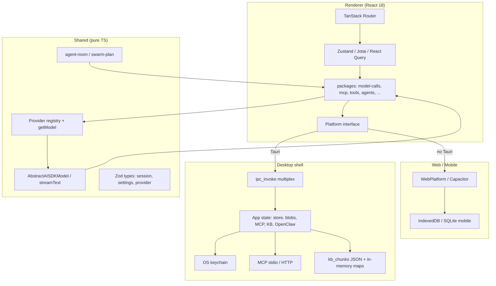

# System Architecture

| | |
| --- | --- |
| **Product** | Chaeboxi 1.6.0 |
| **Last updated** | 2026-08-11 |

Runtime architecture of Chaeboxi: three-layer TypeScript + Tauri shell, platform abstraction, chat/tool path, storage, MCP, and knowledge base.

## High-level diagram



## Layer responsibilities

| Layer | Owns | Must not |
| --- | --- | --- |
| **Renderer** | UI, routing, stores, packages, platform adapters | Import reverse into shared; call OS APIs outside `platform/` |
| **Shared** | Providers, model classes, Zod schemas, pure room/swarm logic | React, DOM, Tauri, Node-only APIs |
| **Tauri (Rust)** | Privileged desktop: store file, secrets, MCP, KB keyword search, FS, OpenClaw WS, shell | Embed business UI logic |

## Initialization flow

`src/renderer/index.tsx` (simplified):

1. Sentry / global error handlers / GA4 setup modules (telemetry **gated** by `TELEMETRY_ENABLED = false`)
2. **Data migration** (`stores/migration.ts`)
3. **Settings store** + last-used model init → **i18n** language
4. React tree: ErrorBoundary → QueryClientProvider → RouterProvider
5. **Non-blocking**: MCP bootstrap + history sync (dynamic imports)

Platform selection (`platform/index.ts`):

1. `NODE_ENV === 'test'` → `TestPlatform`
2. `window.desktopAPI` or Tauri runtime → `DesktopPlatform` (+ Android form factor when build platform is android)
3. Else → `WebPlatform`

## Chat / tool request path

```text
UI (composer / room)
  → session generation / room orchestration (discuss | work | swarm)
  → getModel(settings, globalSettings, ModelDependencies)   // src/shared/providers
  → model.chat() → AbstractAISDKModel → Vercel AI SDK streamText()
  → tool loop (packages/tools, model-calls/toolsets, MCP tools, integrations, video URL, web search)
  → stream chunks → message / session persistence (React Query + StoreStorage)
```

- **ModelDependencies** injects platform-specific HTTP, storage, and capability bridges so shared models stay pure.
- Retry: `AbstractAISDKModel` uses exponential backoff (multiple attempts) around stream failures.
- **OpenClaw** models may route invoke/stream through `openclaw:*` IPC instead of pure HTTP provider APIs.

## Multi-agent room modes

Sessions may attach up to **3** agents (`Session.agentIds`). Modes (native runtime):

| Mode | Behavior (summary) |
| --- | --- |
| **Discuss** (default) | Short sequential rounds; stances; no auto final — user requests Team answer / Keep discussing |
| **Work** | Plan → Do (lead + tools) → Review → Deliver |
| **Swarm** | Orchestrator task board, sequential assignees, deliver |

Full rules, caps, and message roles: [agents-multi-agent-rooms.md](./agents-multi-agent-rooms.md). Pure logic: `src/shared/agent-room.ts`, `swarm-plan.ts`.

## Platform abstraction

| Implementation | When | Capabilities (illustrative) |
| --- | --- | --- |
| `DesktopPlatform` | Tauri / `window.desktopAPI` | Full IPC: store, secrets, MCP, KB, FS, OpenClaw, shell |
| `WebPlatform` | Browser / non-Tauri | IndexedDB storage, web notifications, reduced native surface |
| `TestPlatform` | Vitest | In-memory fakes |

Contract: `src/renderer/platform/interfaces.ts`.  
IPC adapter: `tauri_ipc_adapter.ts` implements `DesktopIPC` (`src/shared/desktop-ipc-types.ts`).

### Build variants

Vite defines (see `vite.renderer.config.ts` / `variables`):

| Variable | Values / role |
| --- | --- |
| `CHATBOX_BUILD_PLATFORM` | `web`, `ios`, `android`, or desktop/`unknown` |
| `CHATBOX_BUILD_TARGET` | `mobile_app` or `unknown` |
| `USE_LOCAL_API` | Dev hook for local API |

Capacitor mobile is detected via build target + platform type; never true under Tauri (including Tauri Android).

## IPC architecture

Single Tauri command:

```text
ipc_invoke(channel: string, args: Value[]) -> Value
```

~90 channel names in `lib.rs`. Groups:

| Group | Examples |
| --- | --- |
| Store | `getStoreValue`, `setStoreValue`, `getStoreBlob`, … |
| System | `getVersion`, `getPlatform`, `getArch`, hostname, paths |
| Window | window show/hide/focus helpers |
| Secrets | `secrets:set`, `secrets:get`, `secrets:delete` |
| HTTP | privileged fetch channels |
| OAuth | local callback listener |
| OpenClaw | `openclaw:test-connection`, `list-agents`, `invoke-agent`, stream cancel |
| MCP | `mcp:server:create|start|list-tools|call-tool|close|list|status` |
| KB | `kb:list|create|update|delete`, `kb:file:*`, `kb:search` |
| FS / process | `fs:*`, `execute_command` |
| Discovery | skills / commands / hooks scan |
| Shell extras | tray, shortcuts, screenshot (`desktop_shell.rs`) |

## Storage architecture

Renderer `StoreStorage` wraps platform `BaseStorage`:

- **Debounced writes** for non-critical keys (e.g. sessions)
- **Immediate writes** for startup-critical keys (settings, configs)
- Keys via `StorageKey` / `StorageKeyGenerator` (`session:{id}`, file blobs, etc.)

Platform backends (see [storage.md](./storage.md)):

| Platform | Settings / configs | Sessions |
| --- | --- | --- |
| Desktop | File storage (IPC) | IndexedDB |
| Mobile | SQLite (Capacitor) | SQLite |
| Web | IndexedDB | IndexedDB |

Migrations: `src/renderer/stores/migration.ts` on startup.

## MCP architecture

```text
Renderer packages/mcp
  → platform IPC
  → mcp:server:* channels
  → Rust: transport config stored per server id
  → list_tools_for_config / call_tool_for_config
       (stdio process or HTTP; connect per operation)
```

- **Desktop**: stdio + HTTP transports via `rmcp`-style client code in Rust.
- **Connect-per-op**: tool list / tool call open a connection for that operation rather than a long-lived multiplexed session per server (status flags track last success/error).
- Legacy Electron `mcp:stdio-transport:*` channel names are rejected/unused under Tauri.

## Knowledge base (desktop reality)

**Rust KB is not SQLite.** Implementation in `lib.rs`:

| Piece | Reality |
| --- | --- |
| Metadata | In-memory `HashMap`s (`bases`, `files`, `file_chunks`) under `KnowledgeBaseState` |
| Chunk persistence | JSON files under app data `kb_chunks/{kb_id}/{file_id}` |
| Search (`kb:search`) | **Keyword / term scoring** over chunk text; top 20 results |
| Embeddings / vector DB in Rust | **Not present** |

Higher-level product flow (upload → chunk → retrieve into chat context) is described in [rag.md](./rag.md). Hosted document-parser cloud is **off** (`CHATBOX_CLOUD_ENABLED = false`). Prefer local parsing.

> **Doc gap vs older AGENTS.md claims:** any description of “SQLite-backed RAG with embeddings in Rust” or `@mastra/rag` as the Tauri KB backend is **outdated**. Trust this file + `lib.rs` for the desktop KB path.

## Security posture

| Topic | Posture |
| --- | --- |
| Data residency | Local-first; chats/settings on device |
| Cloud | `CHATBOX_CLOUD_ENABLED = false` — no Chaeboxi hosted API dependency |
| Telemetry | `TELEMETRY_ENABLED = false` until owned accounts exist |
| Secrets | Keychain channels for integrations; user-supplied LLM keys stored via settings/storage paths |
| Desktop trust | High: FS, command execution, MCP stdio child processes, open CSP for app shell |
| Agent tools | Capability gated by agent tool access + agent mode; treat as privileged |
| Android | Reduced capability set vs full desktop |

Threat model is **single-user desktop / personal device**, not multi-tenant SaaS isolation.

## Gaps and known doc drift

| Claim | Status |
| --- | --- |
| SQLite RAG in Rust | **False** — HashMaps + JSON chunks + keyword search |
| Hosted Chatbox cloud / paid features | **Disabled** in product flags; strip helpers remain for migration stability |
| GitHub Actions CI | **Present** — quality gate (`ci.yml`) + desktop release (`release.yml`); see [deployment-guide.md](./deployment-guide.md) |
| Full mobile parity with desktop MCP/stdio | **Not assumed** — desktop is richest shell |

When fixing AGENTS.md or feature docs, align with this architecture document and the source paths above.

## Related docs

- [project-overview-pdr.md](./project-overview-pdr.md)
- [codebase-summary.md](./codebase-summary.md)
- [code-standards.md](./code-standards.md)
- [storage.md](./storage.md), [rag.md](./rag.md), [agents-multi-agent-rooms.md](./agents-multi-agent-rooms.md)
- [AGENTS.md](../AGENTS.md)
