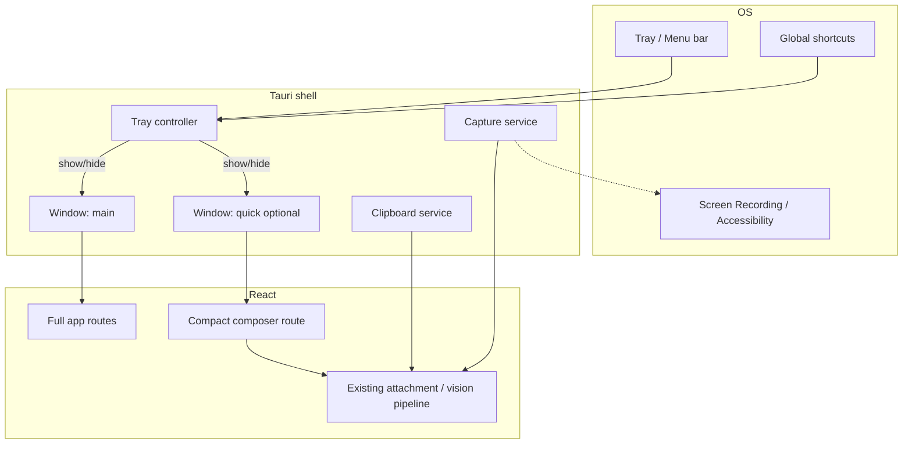

# Research Report: Menu Bar Floating Chat + Screenshot-to-Chat

**Date:** 2026-08-06  
**Project:** Chaeboxi (Tauri 2 + React)  
**Status:** Research / architecture only — no implementation

## Executive Summary

Desktop AI apps (Gemini for Mac, ChatGPT desktop) treat the product as a **background assistant**: menu-bar/tray presence, global hotkey, compact floating composer, optional full window. Chaeboxi today is a **single full window** with no tray, no close-to-tray, and a **stubbed** global shortcut path (`ensureShortcutConfig` → no-op).

**Feasible with Tauri 2:** tray/menu-bar icon, hide-on-close, dual window or compact route, global shortcuts, in-app region screenshot + attach to chat, clipboard-image import after OS capture.

**Not feasible (public APIs):** injecting a “Send to Chaeboxi” button into the **native macOS Screenshot toolbar** (⌘⇧5) or **Windows Snipping Tool** UI. Must use own capture UX, Share Extension (hard), clipboard watch, or “open latest screenshot” instead.

**Linux decision:** ship **system tray + context menu** (StatusNotifier/AppIndicator). Do not promise left-click popup parity with macOS; Linux tray left-click is unreliable/unsupported in Tauri/libappindicator. GNOME often needs tray extension.

## Research Methodology

- Sources: ~15 web sources + Chaeboxi codebase inspection  
- Date range: primarily 2025–2026 docs/product pages  
- Key terms: Tauri 2 system tray, Gemini macOS menu bar, ChatGPT desktop composer, global shortcut, screenshot Share Extension, Snipping Tool third-party  
- Gemini CLI research: **unavailable** (IneligibleTier / Antigravity migration) → WebSearch + official docs

## Table of Contents

1. [Key Findings](#key-findings)
2. [Competitor UX Patterns](#competitor-ux-patterns)
3. [Chaeboxi Current State](#chaeboxi-current-state)
4. [Platform Decision Matrix](#platform-decision-matrix)
5. [Screenshot Reality Check](#screenshot-reality-check)
6. [Tauri Technology Stack](#tauri-technology-stack)
7. [Recommended Architecture](#recommended-architecture)
8. [Phased Plan](#phased-plan)
9. [Risks](#risks)
10. [Unresolved Questions](#unresolved-questions)
11. [References](#references)

---

## Key Findings

### 1. Technology Overview

| Capability | macOS | Windows | Linux |
|---|---|---|---|
| Status icon | Menu bar (NSStatusItem) | Notification area / tray | AppIndicator / SNI |
| Floating mini chat | Common (Gemini, ChatGPT) | Less cultural default; tray + floating works | Tray menu + window show |
| Global hotkey | Standard (⌥Space rivals Spotlight) | Win+ combos conflict risk | Desktop-env dependent |
| Close ≠ quit | Expected for tray apps | Expected for tray apps | Expected if tray present |
| Inject OS screenshot UI button | **No public API** | **No public API** | N/A |
| Own region capture | Screen Recording TCC | WinRT/GDI/etc. | X11/Wayland quirks |

### 2. Current State & Trends (2026)

- Gemini for Mac: menu bar + Dock; **⌥Space** mini chat; **⌥⇧Space** full chat; **double ⌘** shares frontmost window as context; screen context via Accessibility/Screen Recording.  
- ChatGPT Mac: menu bar + Dock settings; **⌥Space**-style lightweight composer; “Work with Apps” via Accessibility; not a classic screenshot snipping product.  
- Industry pattern: **summon composer without context-switching**, optional screen awareness, not “replace Snipping Tool.”

### 3. Best Practices

1. **Close → hide; Quit from tray/menu only** (or Cmd+Q / Exit).  
2. **Left-click tray = toggle floating/main; right-click = menu** on macOS/Windows; **Linux: menu-first**.  
3. **Configurable global hotkeys**; avoid conflicting with OS (Spotlight, Snipping Tool, game overlays).  
4. **macOS template menu-bar icon** (monochrome).  
5. **Permission UX**: Screen Recording / Accessibility explained before first use.  
6. **Screenshot-to-chat**: own capture OR clipboard image attach — not OS toolbar injection.  
7. **YAGNI window model**: one compact webview label first; avoid multi-process complexity.

### 4. Security Considerations

- Screen capture = high-privilege; justify TCC prompts.  
- Floating always-on-top window can overlay password fields — auto-hide on blur recommended.  
- Clipboard image watch: risk of ingesting sensitive clipboard contents; opt-in, short-lived.  
- Capabilities ACL: if second window (`quick`), add to `capabilities/default.json`.

### 5. Performance Insights

- Keep tray process alive = RAM always on; document “runs in background.”  
- Second WebView for composer doubles renderer cost; prefer **same app, second window loading compact route** or **resize main** for MVP.  
- Region capture: prefer streaming PNG/JPEG bytes into existing blob/attachment pipeline, not huge temp files.

---

## Competitor UX Patterns

```text
┌─────────────────────────────────────────────────────────────┐
│  macOS menu bar:  [•••] [wifi] [battery] [Chaeboxi icon]    │
└─────────────────────────────────────────────────────────────┘
         │ left click / hotkey
         ▼
   ┌──────────────────────┐
   │  Compact composer    │  always-on-top optional
   │  [attach][mic][ask]  │  screenshot attach button
   │  recent thread or    │
   │  ephemeral quick chat│
   └──────────────────────┘
         │ “Open full app”
         ▼
   Full Chaeboxi window (sessions, settings, MCP, …)
```

| App | Tray/Menubar | Hotkey | Mini UI | Screen/Screenshot |
|---|---|---|---|---|
| Gemini Mac | Yes | ⌥Space mini, ⌥⇧Space full | Pill / compact chat | Double ⌘ window context; not OS snip toolbar |
| ChatGPT Mac | Yes (Dock+menubar settings) | Composer hotkey | Lightweight composer | App content / screen via Accessibility |
| CleanShot etc. | Capture-focused | Own snip shortcuts | Floating capture | Own capture stack |
| Chaeboxi today | **No** | Settings exist, **not wired** | **No** | Chat attachments only (no capture) |

---

## Chaeboxi Current State

**Evidence from repo:**

- `src-tauri/tauri.conf.json`: single window `main` 1200×800, min 1000×600.  
- `Cargo.toml`: `tauri = { version = "2", features = [] }` — **no `tray-icon`**.  
- `capabilities/default.json`: only `"main"`.  
- `lib.rs` `window:close` → `window.close()`; no `CloseRequested` → hide.  
- `ensureShortcutConfig` → `Ok(Value::Null)` (**stub**).  
- Settings already define `shortcuts.quickToggle` (`Alt+\``, `Alt+Space`, …) and UI in `Shortcut.tsx` — **product intent exists, desktop wiring missing**.  
- Upstream changelog text mentions historical system tray (Electron era); **not present in current Tauri port**.  
- Platform interface: window min/max/close only; no tray/screenshot APIs.

---

## Platform Decision Matrix

### Recommendation

| Platform | Presence | Primary open action | Notes |
|---|---|---|---|
| **macOS** | Menu bar icon (template) | Left-click → toggle floating composer; right-click menu | Match Gemini/ChatGPT; keep Dock icon by default (optional “hide Dock when backgrounded” later) |
| **Windows** | System tray | Left-click → toggle; right-click menu | Standard tray app behavior |
| **Linux** | Tray (AppIndicator/SNI) **if available** | **Context menu** primary; try left-click show when events work | GNOME may hide tray without extension; document. Do not block shipping on perfect left-click |

**Linux decision (explicit):**  
Ship tray + menu. Prefer **“Open Chaeboxi” / “Quick chat” / “Screenshot to chat” / “Quit”** menu items over left-click-only UX. Optional: global hotkey is more reliable than tray click on Linux.

---

## Screenshot Reality Check

### User request: “button on default macOS/Windows screenshot tool”

| Approach | Feasibility | Notes |
|---|---|---|
| Inject button into macOS Screenshot toolbar | **No** | System UI; no public extension point for third-party action buttons |
| Inject into Windows Snipping Tool | **No** | Closed app UI |
| macOS Share Extension (“Share → Chaeboxi”) | **Possible, hard** | Separate app extension target; not the floating toolbar button; high engineering cost |
| Watch Desktop/Screenshots folder | **Yes, fragile** | User path config; race conditions; privacy |
| Clipboard image after OS capture | **Yes, best bridge** | User ⌘⇧4 → image on clipboard → Chaeboxi “Attach clipboard” or auto-detect on quick window open |
| In-app region capture + attach | **Yes, best product control** | Own shortcut + tray menu item; Screen Recording permission on macOS |
| Floating post-capture toast “Send to chat” | **Yes if we own capture** | Only after *our* capture, not OS’s thumbnail |

**Brutal recommendation:** Drop “button inside OS screenshot UI” as a requirement. Replace with:

1. **Chaeboxi Screenshot** (global shortcut + tray menu) → region select → attach to quick/main chat.  
2. **Import from clipboard** (and optional “after screenshot” hint).  
3. Later optional: Share Extension / “Open last screenshot file.”

---

## Tauri Technology Stack

| Need | Recommended | Alt |
|---|---|---|
| Tray / menubar | Tauri 2 `tray-icon` feature + `TrayIconBuilder` / `@tauri-apps/api/tray` | — |
| Hide on close | `WindowEvent::CloseRequested` prevent + `hide()` | — |
| Global hotkeys | `tauri-plugin-global-shortcut` | Implement real `ensureShortcutConfig` |
| Clipboard image | `@tauri-apps/plugin-clipboard-manager` (`readImage`) | CrossCopy clipboard plugin |
| Capture | Rust `xcap` or community `tauri-plugin-screenshots` + custom region UI | Spawn `screencapture` (macOS) / PowerShell (Windows) — brittle |
| Floating window | Second WebviewWindow `quick` (decorations false / alwaysOnTop) | Reuse `main` + compact route (simpler MVP) |
| Multi-window ACL | Extend capabilities `windows: ["main", "quick"]` | — |

Official tray docs: https://v2.tauri.app/learn/system-tray/  
Global shortcut plugin: https://v2.tauri.app/plugin/global-shortcut/

---

## Recommended Architecture

### Systems view



### Design choices (KISS / YAGNI)

1. **MVP window strategy:** Close hides `main`; tray + `quickToggle` shows `main`. No second window yet if schedule tight.  
2. **Product target strategy:** Add labeled window `quick` (~420×560), always-on-top optional, loads `#/quick` compact chat sharing session store.  
3. **Screenshot:** Native capture command → bytes → existing message attachment path (reuse vision-capable models).  
4. **Do not** build OS screenshot toolbar plugin.  
5. **Settings:** extend `ShortcutSetting` with `screenshotToChat`; reuse settings UI patterns.

### Technology Guidance

| Choice | Pros | Cons |
|---|---|---|
| Hide main only (no quick window) | Fastest, least ACL/UI work | Not Gemini-like compact UX |
| Separate `quick` window | True floating composer | Dual WebView memory, routing, state sync |
| Capture via `screencapture -i` CLI | Fast on macOS | Platform forks; process UX; permissions still needed |
| Capture via `xcap` + overlay | Cross-platform control | Region UI work; Wayland pain |
| Clipboard bridge | Instant value after OS snip | User must copy to clipboard; not automatic on all OS snip modes |

---

## Phased Plan

### Phase 0 — Decisions (user)

- [ ] Dock always visible vs hide when window closed (macOS LSUIElement-style later)  
- [ ] Quick chat = ephemeral thread vs last session  
- [ ] Default hotkeys (avoid Gemini/ChatGPT ⌥Space conflict — Chaeboxi already uses `Alt+\`` default)  
- [ ] Accept: no OS screenshot toolbar button

### Phase 1 — Tray + close-to-background (MVP)

1. Enable `tray-icon` feature.  
2. Create tray with icon + menu: Show / Hide, Screenshot to chat (stub ok), Quit.  
3. `CloseRequested` → hide; quit only via menu/Cmd+Q.  
4. Wire `ensureShortcutConfig` + `tauri-plugin-global-shortcut` for `quickToggle`.  
5. macOS template icon assets.  
6. Settings toggle: “Keep running in menu bar / tray.”

**Acceptance:** Close window → app still running; tray click/hotkey restores window.

### Phase 2 — Floating compact chat

1. Create `quick` window config (size, decorations, alwaysOnTop, skipTaskbar optional).  
2. Compact React route: input, model picker minimal, last messages, expand to full.  
3. Tray left-click opens `quick` (macOS/Windows); menu “Open full window.”  
4. Hotkeys: quick vs full (mirror Gemini if desired).

**Acceptance:** Gemini-like summon without full chrome.

### Phase 3 — Screenshot to chat

1. Global shortcut + tray item “Capture screenshot.”  
2. Region capture (macOS first if primary, then Windows, Linux best-effort).  
3. Attach image to focused session / quick composer via existing attachment pipeline.  
4. “Attach from clipboard” action.  
5. Permission onboarding copy for Screen Recording.

**Acceptance:** One shortcut → image in chat composer ready to send.

### Phase 4 — OS capture bridge (optional)

1. Clipboard image detect when quick window opens.  
2. Optional: watch Screenshots folder + notification.  
3. Skip Share Extension unless strong demand.

### Phase 5 — Polish

- Auto-hide quick on blur  
- Position near tray / screen center  
- Multi-monitor  
- Linux tray fallbacks documentation  
- Auto-start with login (optional; platform has `ensureAutoLaunch`)

---

## Risks

| Risk | Severity | Mitigation |
|---|---|---|
| Shortcut conflicts (⌥Space taken by ChatGPT/Gemini) | Med | Keep configurable defaults; `Alt+\`` already product default |
| Linux tray missing on GNOME | Med | Document; hotkey + desktop file; don’t hard-depend |
| Wayland capture broken | High on Linux | Graceful error; clipboard fallback |
| Screen Recording denied | Med | Clear settings deep-link / instructions |
| Dual WebView memory | Med | Lazy-create quick window; destroy on hide optional |
| Users think close = quit loses work | Low | First-run toast: “Still running in menu bar” |
| Scope creep: Accessibility “see whole screen like Gemini” | High | Out of scope for v1; screenshot attach only |

---

## Implementation Recommendations

### Quick Start (for future implementer)

1. `Cargo.toml`: `tauri = { version = "2", features = ["tray-icon"] }`  
2. Add `tauri-plugin-global-shortcut`, `tauri-plugin-clipboard-manager`  
3. Rust setup: `TrayIconBuilder`, close→hide, register shortcuts from settings  
4. Replace `ensureShortcutConfig` stub with real register/unregister  
5. Frontend: optional `#/quick` route; event listeners for tray actions  
6. Capabilities: allow tray + shortcut + second window if needed

### Common Pitfalls

- Calling `close()` instead of `hide()` → process dies, tray useless.  
- Forgetting multi-window in capabilities → IPC dead on `quick`.  
- Using colorful icon in macOS menu bar (should be template).  
- Promising OS snip toolbar integration in marketing.  
- Linux left-click handlers that never fire.

---

## Resources & References

### Official / product

- Tauri System Tray: https://v2.tauri.app/learn/system-tray/  
- Tauri Global Shortcut: https://v2.tauri.app/plugin/global-shortcut/  
- Tauri Clipboard Manager: https://v2.tauri.app/reference/javascript/clipboard-manager/  
- Gemini for Mac: https://gemini.google/mac/  
- ChatGPT Work with Apps (macOS): https://help.openai.com/en/articles/10119604-work-with-apps-on-macos  

### Community

- Tauri tray left-click limitations (Linux): StackOverflow / libappindicator notes  
- Menu bar app guide (Tauri v2): DEV.to “macOS Menu Bar App with Tauri v2”  
- `tauri-plugin-screenshots` / xcap for monitor/window capture  

---

## Appendices

### A. Glossary

- **Tray / menu bar icon:** Persistent OS chrome icon while app may be windowless.  
- **Close-to-tray:** Window close hides UI; process keeps running.  
- **Quick / floating composer:** Small always-available chat UI.  
- **TCC:** macOS Transparency, Consent, and Control privacy prompts.

### B. Chaeboxi gap checklist

| Feature | Status |
|---|---|
| Tray icon | Missing |
| Hide on close | Missing |
| `quickToggle` wired | Settings only; IPC stub |
| Floating quick window | Missing |
| Screenshot capture | Missing |
| Clipboard image attach | Partial/unknown in chat paste — verify during impl |
| OS screenshot toolbar button | Impossible as stated |

### C. Unresolved Questions

1. Should closing the red traffic light quit on user preference, or always hide?  
2. Quick chat session model: new ephemeral vs continue last?  
3. macOS: hide Dock icon when backgrounded? (LSUIElement / activation policy)  
4. Primary ship platforms for v1 capture (macOS-only first OK?)  
5. Is vision-model requirement enforced before allowing screenshot attach?  
6. Mobile/web: feature desktop-only — confirm no surface pollution.

---

## Next Actions

1. Product accept/reject: OS toolbar button → **clipboard + own capture**.  
2. Product pick MVP: **Phase 1 only** vs **Phase 1+2**.  
3. Spike (1–2 days): tray + hide-on-close + global `quickToggle` on macOS.  
4. Spike capture: region select → blob → existing attachment path.  
5. Then formal `/plan` with phase files under `plans/2026-08-06-menubar-floating-chat-screenshots/`.
