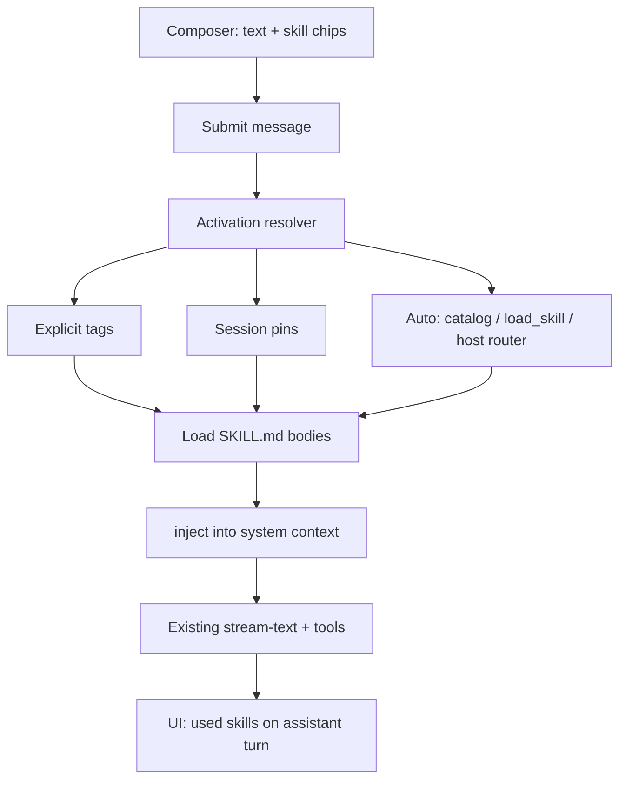

# Plan: Ship Agent Skills (auto-select + multi-tag)

**Status:** Implemented (v1 core)  
**Created:** 2026-08-07  
**Research:** [research/agent-skills-research.md](./research/agent-skills-research.md)  
**Trigger:** `$skill-name` (multi-tag chips)  
**Principles:** YAGNI · KISS · DRY — reuse inject pipeline, token estimator, command picker  
**Docs:** `docs/skills.md`

---

## Goal

Ship a **Skills** feature in Chaeboxi comparable to Claude/Cursor Agent Skills:

1. Users manage modular skills (`SKILL.md`-compatible)
2. **AI auto-chooses** relevant skills for a turn
3. Users can **tag multiple skills** in chat (`$skill` / chips)
4. Skills stay separate from Copilots (persona) and MCP (tools)

---

## Non-goals (v1)

- Skill marketplace / remote install
- Arbitrary skill script execution
- Replacing Copilots or system prompt presets
- Always-on full skill body injection

---

## Architecture (target)



### Layering

| Layer | Responsibility |
|-------|----------------|
| Skill registry | CRUD, enable, parse SKILL.md, builtin seeds |
| Activation | explicit ∪ session ∪ auto → ordered skill list |
| Context inject | catalog (always) + bodies (activated) into system prompt path |
| UI | Settings manager + composer multi-tag + “used skills” chips |
| Storage | Local-first via existing storage layer |

### Key integration points (existing code)

- `injectModelSystemPrompt` / `generation.ts` / `stream-text.ts` — context injection
- `OpenClawCommandPicker` — fuzzy multi-skill picker pattern
- `token-estimation` — budget auto-load count
- `CopilotDetail` — **do not overload**; keep `session.copilotId` as persona only
- Message/session Zod schemas — add `skillIds` / activation metadata

---

## Phases

| Phase | Name | Outcome | Depends |
|-------|------|---------|---------|
| 0 | Product decisions | Locked UX + scope answers | — |
| 1 | Core model + storage | Skills persist, parse, list | 0 |
| 2 | Explicit multi-tag + inject | User tags work end-to-end | 1 |
| 3 | Auto-select | Model/host picks skills | 2 |
| 4 | Manage UI + import | Settings, builtin pack, SKILL.md import | 1–2 |
| 5 | Polish + docs | History chips, caps, tests, docs | 2–4 |

---

## Phase 0 — Product decisions (1 short session)

**Decide before code:**

1. Trigger UX: `@` chips (recommended) and/or `/skill`
2. Tag stickiness: session chips sticky until cleared (recommended)
3. Auto default: ON for new sessions
4. Max auto skills per turn: **2** (hard cap), max explicit: **5**
5. Builtin skills: seed 2–3 (e.g. deep-research, code-review style) without removing copilots
6. Storage: app-managed only in v1 (folder watch desktop = later)

**Acceptance:** written answers in plan notes or ADR.

---

## Phase 1 — Core model + storage

**Files (expected):**

- `src/shared/types/skills.ts` (or extend `types.ts` carefully)
- `src/renderer/packages/skills/` — parse, registry, activate helpers
- Storage key for skill packages
- Zod schemas for message/session skill refs

**Requirements:**

- Skill = `{ name, description, instructions, enabled, source, id }`
- Parser: YAML frontmatter + markdown body (agentskills.io compatible)
- Builtin skills shipped in-app (static)
- Registry: list enabled, get by name/id, enable/disable

**Tests:** parse valid/invalid SKILL.md; registry CRUD; name validation (kebab-case)

**Risks:** circular deps in shared types — keep skill types leaf-friendly

---

## Phase 2 — Explicit multi-tag + inject

**Files (expected):**

- `InputBox` + new `SkillPicker` (mirror OpenClaw picker)
- Message payload: `skillIds: string[]` (or names)
- `generation.ts` / message-utils: resolve skills → inject blocks

**Inject format (simple):**

```text
## Available skills (catalog)
- pdf-processing: ...
- code-review: ...

## Active skills
### skill: code-review
<instructions body>
```

**Behavior:**

- User selects multiple skills via `@` → chips
- On send: message stores activated skill ids
- System context includes those bodies **this turn** (and optionally sticky session list)
- Works with/without agent mode; no dependency on MCP

**Acceptance:**

- Tag 2 skills → both bodies present in outbound system context
- Untag → bodies gone next message
- Token estimator reflects added skill tokens

---

## Phase 3 — Auto-select

### 3a — Catalog + prompt routing (all models)

- Always inject enabled skill **name+description** catalog
- System instruction: “When a skill matches the task, follow its instructions if already loaded; if not loaded, prefer skills the user tagged. If auto-skills enabled and no tags, apply the most relevant skill(s) by name in a structured way.”

**Limitation:** without a load tool, host must pre-select or model only “knows about” skills but can’t pull body.

### 3b — Host-side auto (recommended v1 reliability)

- On turn start (auto ON, no explicit tags or as supplement): score user text vs skill descriptions (keyword / simple BM25)
- Load top-k (≤2) skill bodies before model call
- Mark activation `mode: 'auto'` for UI

### 3c — Tool-based load (tool_use models, v1.1)

- Register `load_skill({ name })` tool
- Model loads skill mid-turn when catalog matches
- Prefer for agent mode; keep 3b as fallback for non-tool models

**Acceptance:**

- No tags + auto ON + message “review this PR” → code-related skill auto-loads
- Auto OFF → no auto bodies
- Explicit tags always included even if auto would pick different set
- Cap enforced

---

## Phase 4 — Manage UI + import

- Settings route or section: list skills, enable, edit description/body, delete
- Create skill form (name, description, instructions)
- Import: paste/upload `SKILL.md` or zip (desktop); validate frontmatter
- Export: download SKILL.md
- Optional: convert system prompt preset → skill (one-click)

**Acceptance:** create → tag → use without restart; import standard SKILL.md from ecosystem

---

## Phase 5 — Polish

- Assistant message footer: “Skills used: A, B”
- Session settings: pinned skills + auto toggle
- Context budget: refuse auto-load if over remaining budget (warn)
- i18n strings
- Docs: `docs/skills.md` (user + developer)
- Regression tests on generation path

---

## Decision framework

| Decision | Recommendation | Why |
|----------|----------------|-----|
| Format | agentskills.io SKILL.md | Portability, ecosystem |
| Auto v1 | Host top-k + catalog | Works on all providers |
| Auto v1.1 | `load_skill` tool | Better for agent/tool models |
| Multi-tag | `@` chips multi-select | Clear UX; OpenClaw pattern exists |
| Copilot relation | Orthogonal | Avoid god-object persona |
| Scripts | Defer | Security + sandbox cost |
| Marketplace | Defer | YAGNI |

---

## Success criteria (ship bar)

- [ ] User can create/import a skill and enable it
- [ ] User can attach **multiple** skills to a message via tags
- [ ] With auto on, relevant skill activates without tags (demo skill pair)
- [ ] Catalog token cost bounded; full bodies only for active skills
- [ ] Copilot + MCP + skills can combine in one session without conflict
- [ ] Unit tests for parser + activation resolver; smoke test on generation inject

---

## Risks & mitigations

| Risk | Impact | Mitigation |
|------|--------|------------|
| Context bloat | Quality drop, cost | Progressive disclosure + hard caps |
| Auto wrong skill | Bad answers | Explicit wins; show used skills; easy disable |
| Confusion with Copilot | Support burden | Copy + UI: “Persona vs Skills” |
| Prompt injection via skill body | Security | User-authored trust model; no remote auto-install |
| Weak models ignore catalog | Auto fails | Host-side router 3b |
| Scope creep (marketplace, scripts) | Delay ship | Phases gated; v1 non-goals |

---

## Effort sketch (rough)

| Phase | Size |
|-------|------|
| 0 | 0.5 day |
| 1 | 1–2 days |
| 2 | 2–3 days |
| 3 | 2–3 days |
| 4 | 2 days |
| 5 | 1–2 days |
| **Total v1** | **~8–12 eng days** |

---

## Next actions

1. Confirm Phase 0 product answers (especially auto default + max skills)
2. Approve architecture: progressive disclosure + host auto + multi-tag
3. Run `/cook` (or implement) Phase 1–2 as first shippable slice
4. Demo: 2 skills, multi-tag, auto on/off before Phase 4 polish

---

## Open questions (need you)

1. Prefer `@skill` chips, `/skill` slash, or both?
2. Should pinned skills be per-session, per-folder, or global defaults?
3. Migrate any existing copilots into builtin skills, or keep both forever?
4. Desktop folder sync (`./skills` in project) in v1 or later?
