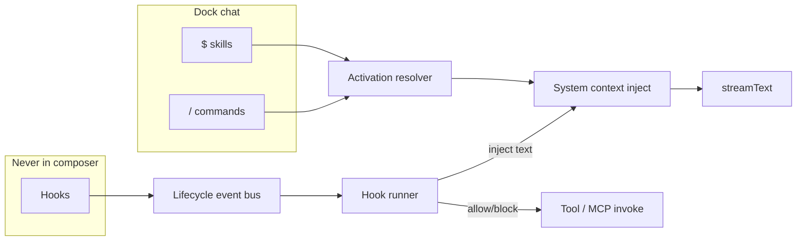

# Plan: Commands (`/`) + Global Hooks (agent-import + shell)

**Status:** In progress — Phases 0–4 scaffolded (commands + hooks core)  
**Created:** 2026-08-08  
**Repo:** Chaeboxi (Chatbox CE fork)  
**Related:** `docs/skills.md`, `plans/260807-1458-skills-feature/`, skills pipeline  
**Principles:** YAGNI · KISS · DRY — reuse skills scan/store/inject/picker patterns  

---

## Goal

Ship two extensibility surfaces that match industry coding agents (Claude Code / Cursor), with **clear UX separation from Skills**:

| Feature | Trigger | Taggable in dock chat? | Auto? | Scope |
|---------|---------|------------------------|-------|-------|
| **Skills** (existing) | `$name` chips + auto-match | Yes (`$`) | Yes | On-demand procedures |
| **Commands** (new) | `/name` chips | Yes (`/`) | **No** | User-invoked prompt packages |
| **Hooks** (new) | Lifecycle events | **No** | **Always** (when enabled) | Global always-on automation |

Users get:

1. **Commands** — same lifecycle as skills (discover, enable, tag, inject body) but only via `/`
2. **Hooks** — invisible, global always-on; auto-import from Claude/Cursor agent setups; **include shell/script hooks** (desktop)
3. Shared agent-folder discovery so existing Claude/Cursor projects “just work” inside Chaeboxi

---

## Locked product decisions

| # | Decision |
|---|----------|
| 1 | **Forever:** `$` = skills only, `/` = commands only. No dual-trigger skills. |
| 2 | **Hooks are global always-on** (not per-agent/copilot). Settings can disable individual hooks. |
| 3 | **Shell hooks in v1** (desktop), with hard security guardrails. |
| 4 | **Scan roots:** hybrid (recommended below). |
| 5 | **OpenClaw ignored.** Do not design `/` around OpenClaw. Treat `/` as pure CommandPicker for chat. Leave any legacy OpenClaw picker code alone unless it blocks `/` commands — if conflict, prefer Commands for non-OpenClaw product surface. |

---

## Decision 4 — Scan roots (recommendation)

### Problem today

`skills:scan` resolves `./.claude/skills` against **process CWD** (`expand_skill_root_path` in Rust). Session `workspaceRoot` is **not** used. If the user opens Chaeboxi from Applications but sets workspace to `/Users/me/my-repo`, project skills/commands/hooks under that repo are **missed**.

### Recommended: hybrid workspace-aware scan

```text
Always:
  ~/.claude/{skills,commands} + settings hooks
  ~/.cursor/{skills,commands,hooks.json}
  …other user-global agent roots

When session.workspaceRoot is set:
  {workspaceRoot}/.claude/{skills,commands} + settings.json hooks
  {workspaceRoot}/.cursor/{commands,hooks.json}
  …project-local roots under workspaceRoot

When workspaceRoot is unset:
  Fall back to process CWD for relative project roots (current skills behavior)
```

| Option | Pros | Cons | Verdict |
|--------|------|------|---------|
| A. Process CWD only | Zero change to skills scan | Wrong for most desktop users | Reject |
| B. workspaceRoot only | Correct for agent mode | Misses user-global + blank sessions | Reject alone |
| **C. Hybrid (workspace + global)** | Matches Claude/Cursor mental model | Slightly more cache invalidation | **Adopt** |
| D. Multi-workspace registry | Future multi-project | Overkill | Later |

**Adopt C** for **commands + hooks**, and **upgrade skills scan in the same shared scanner** so all three stay consistent (small DRY win; avoid three root policies).

**Cache rule:**

- User-global scan: app session / manual rescan
- Project scan: keyed by `workspaceRoot` (or `"__cwd__"`); refresh on workspace change and before generation if root changed

**Web/mobile:** no filesystem scan (same as skills); user-created commands in app storage only; hooks declarative-only or empty.

---

## Non-goals (v1)

- OpenClaw slash integration
- Skill marketplace / remote install
- Per-agent hook attachments (hooks stay global)
- Full Claude 30-event matrix
- Auto-matching commands from free text
- Tagging hooks in composer
- Hook/command marketplace UI
- Running shell hooks on web/mobile
- Unifying skills into `/` (explicitly rejected)

---

## Architecture

### Product model



### Layering

| Layer | Responsibility |
|-------|----------------|
| **Shared agent scan** | Desktop FS: skills / commands / hooks roots under global + workspace |
| **Command registry** | Parse markdown commands, enable/disable, merge priority |
| **Command UI** | `/` picker + chips (clone skill UX) |
| **Command inject** | Explicit only → system block “Active commands” |
| **Hook registry** | Import + enable; global list; no composer |
| **Hook event bus** | SessionStart, PreTurn, PostTurn, PreToolUse, PostToolUse (+ Stop optional) |
| **Hook runner** | Declarative + shell; timeout; exit-code block; audit log |
| **Settings** | Skills \| Commands \| Hooks tabs (or three routes) |

### Command vs skill (behavior contract)

| | Skills | Commands |
|--|--------|----------|
| Trigger | `$` | `/` |
| Auto-match | Yes (max 2) | **No** |
| Session pin | Yes (`pinnedSkillIds`) | Optional v1.1 — skip v1 |
| Catalog inject | Yes (capped) | Optional short list or none (prefer bodies only when tagged) |
| Body inject | When activated | When tagged |
| Multi-tag | Max 5 explicit | Share explicit budget **or** separate max 5 — **use separate max 5 commands** |
| Message fields | `skillIds[]` | `commandIds[]` |
| Agent UI chips on assistant | `skillActivations` | `commandActivations` (optional, same pattern) |

### Hook model (global always-on)

```text
HookDefinition {
  id, name?, description?
  event: SessionStart | PreTurn | PostTurn | PreToolUse | PostToolUse | Stop?
  enabled: boolean          // user toggle; default true for imported
  origin: claude|cursor|project|user|builtin
  originPath?: string
  kind: declarative | command   // command = shell/script
  // declarative payload (reuse copilot-hooks types where possible)
  // shell: command string, matcher?, timeoutMs
  matcher?: string          // tool-name regex for Pre/PostToolUse
}
```

**Always-on means:** if `enabled` and event fires, it runs — no tag, no agent binding.  
**Project hooks** still only apply when that project’s workspace is active (they are “global within the active workspace,” not per-copilot).

**Merge order (deterministic):**

1. Built-in Chaeboxi safety hooks (if any)
2. User-global imported (`~/.claude`, `~/.cursor`, …)
3. Project imported (`{workspace}/.claude`, …)
4. User app overrides (enable/disable by id)

On conflict (same id/path): later list replaces earlier for that path; enable overrides live in app storage.

### Hook events (v1)

| Event | Fire point | Shell allowed? | Primary use |
|-------|------------|----------------|-------------|
| `SessionStart` | Session enter / workspace set / agent mode on | Yes | Context inject from script stdout |
| `PreTurn` | Before stream (existing pre-hook site) | Yes (stdout → inject) | Guardrails, context |
| `PostTurn` | After generation completes | Yes | Validate, log |
| `PreToolUse` | Before agent tool / MCP call | Yes (exit 2 = **block**) | Secrets, dangerous bash |
| `PostToolUse` | After tool result | Yes | Format, audit |
| `Stop` | Cancel / complete (optional if time) | Yes | Later grind loops — **defer if tight** |

### Shell hook security (required for “yes shell in v1”)

| Guardrail | Rule |
|-----------|------|
| Platform | Desktop only |
| Opt-in master switch | Settings: **Enable shell hooks** default **off** until user enables once |
| Timeout | Default 10s, max 30s |
| Working directory | `workspaceRoot` if set, else home (never arbitrary) |
| Env | Minimal allowlist; do not pass API keys by default |
| stdin | JSON payload (event, tool name, paths); no secrets |
| stdout | Truncate inject text (e.g. 8KB) |
| Exit codes | `0` ok; `2` block (PreToolUse); other = fail soft + log |
| Path deny | Default block matchers for `.env`, credentials paths (builtin PreToolUse) |
| Audit | Last N runs in Settings → Hooks (time, event, exit, truncated output) |
| UI | Hooks never appear as `$`/`/` chips |

### Import sources

**Commands:**

| Origin | Paths |
|--------|--------|
| Project | `{ws}/.claude/commands`, `{ws}/.cursor/commands`, `{ws}/.agents/commands`, `{ws}/.codex/commands`, `{ws}/.grok/commands`, `{ws}/commands` |
| User | `~/.claude/commands`, `~/.cursor/commands`, `~/.agents/commands`, `~/.codex/commands`, `~/.grok/commands` |

Format: `name.md` or folder with body; YAML frontmatter `name`, `description`; body = prompt. Normalize names like skills (`ck:plan` → `ck-plan` for `/ck-plan`).

**Hooks:**

| Origin | Config |
|--------|--------|
| Claude | `~/.claude/settings.json`, `{ws}/.claude/settings.json` → `hooks` |
| Cursor | `~/.cursor/hooks.json`, `{ws}/.cursor/hooks.json` |
| Scripts dir | `{ws}/.claude/hooks/*`, `~/.claude/hooks/*` (registered via settings) |

Parsers: **tolerant** — skip unknown events/fields; log debug.

**Ignore OpenClaw** gateway command catalogs entirely for this feature.

### Composer (`/`) — ignore OpenClaw product-wise

Target behavior for **chat** sessions:

1. User types `/` → `CommandPicker` (same UX as `SkillPicker`)
2. Select → chip above input; multi-select up to max
3. Submit → `message.commandIds[]` + optional strip `/tokens` from text
4. Generation injects active command bodies
5. **Do not** show hooks in any picker

If legacy OpenClaw code paths still gate `/` when an OpenClaw model is selected, **out of product scope** — either leave as dead code path or force CommandPicker always for chat (prefer always CommandPicker for this product since OpenClaw is not used).

**Presets:** Today `/` may also interact with preset picker in some states — resolve priority:

```text
/ at start of input (single line) → CommandPicker
(not presets, not skills)
$ → SkillPicker
@ → AgentPicker (room)
```

Preset discoverability moves to its own UI control if `/` is taken (verify current preset trigger; if presets already use `/`, rehome presets to a button/menu only — **do not share `/`**).

---

## Phases

| Phase | Name | Outcome | Depends |
|-------|------|---------|---------|
| 0 | Docs + scan foundation | Product contract + shared workspace-aware scan API | — |
| 1 | Commands core | Parse, store, settings, inject without UI polish | 0 |
| 2 | Commands composer | `/` picker, chips, E2E chat | 1 |
| 3 | Hooks registry + declarative | Import global hooks; Pre/PostTurn always-on | 0 |
| 4 | Shell hooks + tool events | Pre/PostToolUse, shell runner, security | 3 |
| 5 | Polish, tests, docs | Audit UI, caps, migration notes | 1–4 |

Phases **1–2** and **3–4** can partially parallelize after Phase 0 (commands vs hooks ownership split).

---

## Phase 0 — Docs + shared scan foundation

### Requirements

- Document product contract
- Introduce **workspace-aware** root expansion used by skills/commands/hooks
- Single desktop scan entry (extend Tauri or add `agent-ext:scan`)

### Files (expected)

| Action | Path |
|--------|------|
| Create | `docs/hooks-and-commands.md` |
| Update | `docs/skills.md` (scan hybrid note; `$` vs `/` table) |
| Extend | `src-tauri/src/lib.rs` (`skills:scan` → accept optional `baseDir` / absolute roots) |
| Extend | `src/renderer/packages/skills/discover-agent-skills.ts` (or new `packages/agent-scan/`) |
| Touch | `skillsStore` refresh to pass `workspaceRoot` |

### Steps

1. Write `docs/hooks-and-commands.md` (matrix, non-goals, security, roots).
2. Add helper: `resolveProjectRoots(workspaceRoot?: string) → absolute paths`.
3. Change Rust expand to prefer absolute paths from renderer (renderer computes absolute project roots from workspace).
4. On `workspaceRoot` change → refresh agent skills (+ later commands/hooks).
5. Unit tests for path resolution.

### Validation

- With workspace set to a fixture repo, project skills under that repo appear.
- Without workspace, CWD fallback still works.
- User-global `~` roots still load.

### Risks / rollback

- Changing skills scan may surprise users who relied on app CWD — document; hybrid is strictly more correct.

---

## Phase 1 — Commands core

### Requirements

- `CommandPackage` type + storage
- Discover agent command markdown
- Inject on explicit activation only
- Settings list enable/disable + import/export optional

### Files

| Action | Path |
|--------|------|
| Create | `src/shared/types/commands.ts` |
| Create | `src/renderer/packages/commands/` (`parse-command-md.ts`, `discover-agent-commands.ts`, `index.ts`) |
| Create | `src/renderer/stores/commandsStore.ts` |
| Create | `src/renderer/routes/settings/commands.tsx` (+ route tree) |
| Extend | `src/shared/types/session.ts` / message types — `commandIds?`, `commandActivations?` |
| Extend | `src/renderer/stores/session/generation.ts` — inject command bodies |
| Tests | `parse-command-md.test.ts`, activation tests |

### Command package shape

Mirror skills (DRY):

```ts
CommandPackage {
  id, name, description, instructions
  enabled, source: 'user' | 'import' | 'agent'
  origin?, originPath?, displayName?
}
```

### Inject shape (generation)

```markdown
## Active commands
### /review
{body}
```

No auto resolver. No catalog spam unless we add a one-line “Commands: /a, /b” later (skip v1).

### Caps

- Explicit commands per message: **max 5**
- Agent scan cap: align with skills (e.g. 500 files)

### Validation

- Unit: parse, name normalize, merge priority (user > project agent > global agent)
- Integration: message with `commandIds` injects body once

### Risks

- Duplicate names across trees — first-wins like skills (project before global)

---

## Phase 2 — Commands composer (`/`)

### Requirements

- `CommandPicker` + chips in `InputBox`
- Token helpers for `/name` (do not treat URLs `https://` — only `/` at token boundary / start)
- Keyboard UX parity with skills

### Files

| Action | Path |
|--------|------|
| Create | `src/renderer/components/InputBox/CommandPicker.tsx` |
| Create | `src/renderer/packages/commands/slash-tokens.ts` |
| Extend | `InputBox.tsx` — picker priority, chips, submit payload |
| Extend | i18n strings |
| Tests | slash token extract / strip / currency false positives (`// comment` ignore) |

### Composer priority (locked)

```text
if chat && activeCommandSlashQuery → CommandPicker
else if skill $ query → SkillPicker
else if agent @ query → AgentPicker
// presets: must not use bare "/" — move if currently conflicting
```

### Slash token rules

- Trigger: `/` at start of word, not mid-URL
- Query ends at whitespace
- Chips sticky per message compose (like skills)
- Strip tokens from sent text optionally (match skill strip behavior)

### Validation

- Manual: type `/` → list; select → chip; send → model sees command body
- Multi-command chips
- Skills `$` still independent on same message
- Hooks never listed

### Risks

- Preset collision: audit InputBox preset trigger; rehome if needed before ship

---

## Phase 3 — Hooks registry + declarative always-on

### Requirements

- Import hooks from Claude/Cursor configs
- Global list in Settings; enable/disable
- Wire PreTurn / PostTurn through shared executor (merge with — but not replaced by — legacy copilot pre/post hooks)
- **No composer surface**

### Files

| Action | Path |
|--------|------|
| Create | `src/shared/types/hooks.ts` |
| Create | `src/renderer/packages/hooks/` (`discover.ts`, `parse-claude-settings.ts`, `parse-cursor-hooks.ts`, `executor.ts`, `events.ts`, `index.ts`) |
| Create | `src/renderer/stores/hooksStore.ts` |
| Create | `src/renderer/routes/settings/hooks.tsx` |
| Extend | `generation.ts` — fire global PreTurn/PostTurn |
| Optional | Deprecate UI copy for copilot-only hooks as “legacy agent hooks” or keep both: **global hooks always run; copilot hooks still run when agent set** |

### Copilot hooks coexistence

- **Keep** existing `copilot-hooks` declarative types for per-agent extras
- **Global hooks** always run first (or last — pick **global first**, then agent)
- Document: new power users use global import; agent hooks remain for persona-specific injects

### Declarative kinds (v1 reuse)

- `inject-context`, `inject-datetime`, `inject-system-info`, `web-fetch`, `validate-format`
- Map imported Claude **prompt** hooks to inject if feasible; else skip until shell phase

### SessionStart

- Fire once per session id + workspace key when session view loads / generation first runs

### Validation

- Fixture `settings.json` with PreTurn inject → context appears without user tagging
- Disable in Settings → no inject
- Composer pickers unchanged (no hooks)

---

## Phase 4 — Shell hooks + Pre/PostToolUse

### Requirements

- Desktop shell runner with security table above
- Master switch **Enable shell hooks** (default off)
- PreToolUse / PostToolUse around tool execution path
- Exit code 2 blocks tool with user-visible reason
- Audit log (in-memory + optional persisted last 50)

### Files

| Action | Path |
|--------|------|
| Extend | `packages/hooks/shell-runner.ts` |
| Extend | Tauri command `hooks:run-shell` (sandbox cwd, timeout, kill) |
| Extend | Agent tool invocation site(s) in renderer (`packages/tools`, generation tool path, MCP) |
| Extend | Settings hooks UI — master switch, audit table |
| Builtin | Optional default deny-read `.env` PreToolUse matcher |
| Tests | Shell runner mock; block path; timeout |

### Tool wiring

Find single choke point for tool calls (prefer one wrapper around tool execute). Fire:

```text
PreToolUse(hooks matching tool name) → if any block → skip tool, return error to model
execute tool
PostToolUse(...)
```

### Shell payload (stdin JSON)

```json
{
  "event": "PreToolUse",
  "toolName": "Bash",
  "toolInput": { },
  "sessionId": "...",
  "workspaceRoot": "..."
}
```

### Validation

- Shell disabled → scripts never run
- Shell enabled + fixture script exit 2 → tool blocked
- Timeout → fail soft, chat continues
- Web build: no Tauri shell path

### Risks / rollback

- Highest risk phase — ship behind master switch; kill switch in settings
- Rollback: disable shell runner leave declarative hooks

---

## Phase 5 — Polish, tests, docs

### Requirements

- Docs complete and linked from skills doc
- Settings nav: Skills, Commands, Hooks
- Rescan button (shared) for agent folders
- i18n
- Focused vitest coverage
- Lint / typecheck clean on touched files

### Files

| Action | Path |
|--------|------|
| Update | `docs/hooks-and-commands.md`, `docs/skills.md`, `AGENTS.md` brief mention if architecture section exists |
| Update | Settings layout / nav |
| Tests | Token, parse, merge, hook event order, path resolve |

### Acceptance criteria (whole feature)

- [ ] `$` only activates skills; `/` only activates commands
- [ ] Commands never auto-match from free text
- [ ] Hooks never appear in dock pickers/chips
- [ ] Hooks run global always-on when enabled
- [ ] Project commands/hooks load from `session.workspaceRoot` when set
- [ ] User-global agent trees still load
- [ ] Shell hooks desktop-only, master switch default off, timeout + block codes work
- [ ] Multi-tag commands + multi-tag skills on same message work
- [ ] OpenClaw not required for any path
- [ ] No secrets committed; no shell on web

---

## Implementation strategy notes

### Parallelism after Phase 0

| Track A (Commands) | Track B (Hooks) |
|--------------------|-----------------|
| Phase 1 core | Phase 3 registry + declarative |
| Phase 2 composer | Phase 4 shell + tools |
| Merge → Phase 5 | |

File ownership:

- **A:** `packages/commands/**`, `CommandPicker`, `commandsStore`, commands settings, message `commandIds`, generation command inject
- **B:** `packages/hooks/**`, `hooksStore`, hooks settings, generation pre/post global, tool wrapper, Tauri shell
- **Shared (serialize):** agent-scan path helper, Tauri scan, `docs/hooks-and-commands.md`, generation.ts inject/hook call order

### Generation.ts call order (target)

```text
1. SessionStart hooks (once)
2. Global PreTurn hooks → inject
3. Agent/copilot PreTurn hooks → inject
4. Plan / tools instructions
5. Skills catalog + active skill bodies
6. Active command bodies
7. streamText (+ Pre/PostToolUse around tools)
8. Global PostTurn + agent PostTurn
```

### Storage keys

- Reuse pattern from `StorageKey.Skills`
- Add `StorageKey.Commands`, `StorageKey.HookOverrides` (enable map + shell master switch + audit optional)

---

## Risks summary

| Risk | Mitigation |
|------|------------|
| Shell RCE via imported hooks | Master switch default off; timeout; cwd lock; audit; desktop only |
| Preset vs `/` collision | Audit InputBox; rehome presets |
| Skills scan behavior change | Hybrid is additive; document |
| generation.ts complexity | Thin facades `runGlobalPreTurn()`, `injectCommands()` |
| Token bloat | Commands: bodies only when tagged; hooks inject truncated |
| Dual hook systems confusion | Docs: global vs agent-legacy |

---

## Success metrics (qualitative)

- User with existing `~/.claude/commands` + project `.cursor/commands` sees them under `/` after rescan
- User with Claude `settings.json` hooks sees them in Settings → Hooks and they fire without chat tags
- Power user enables shell hooks and blocks a tool via PreToolUse exit 2

---

## Next steps after plan approval

1. Save plan copy under repo `plans/260808-hooks-and-commands/` (plan.md + phase files) if you want durable project history
2. Implement Phase 0 → 1 → 2 first for user-visible `/` commands
3. Then Phase 3 → 4 for hooks
4. Phase 5 docs/tests/ship

---

## Open items (non-blocking)

- Exact preset rehome UI if presets currently bind `/` (discover during Phase 2)
- Whether SessionStart fires on every session switch or once per app launch + workspace (prefer: once per sessionId+workspaceRoot)
- Stop event + “grind” follow-up messages — defer to v1.1 unless easy

---

## Unresolved questions

None blocking. Decision 4 closed as **hybrid workspace-aware scan**. Proceed on approval.
