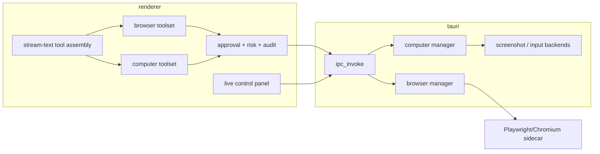

# Plan: use_browser + use_computer

**Status:** Architecture proposal (not implementation)  
**Date:** 2026-08-11  
**Research:** `claudedocs/research-use-browser-use-computer-2026-08-11.md`

## Goal

Add two **desktop-first agent capabilities**:

1. **use_browser** — agent drives an isolated browser via structured tools.
2. **use_computer** — agent observes/controls OS GUI under strict consent.

Align with Chaeboxi: local-first, BYOK, existing toolset/approval/MCP patterns, no hosted broker.

## Non-goals (v1)

- Web/mobile parity
- Hijacking user’s daily Chrome profile by default
- Full OSWorld-chasing autonomous desktop employee
- Provider-locked Anthropic/OpenAI-only computer APIs as the only path
- Silent Accessibility/Screen Recording grants

## Decision record (recommended)

| Decision | Choice | Why |
| --- | --- | --- |
| Order | Browser → Computer | Higher value, fewer OS perms, better reliability |
| Browser perception | A11y snapshot primary; screenshot secondary | Tokens + grounding |
| Browser isolation | Fresh profile default | Security |
| Integration style | First-party toolset + platform controller | Approval UX, kill switch, product quality |
| Spike path | Optional Playwright MCP | Validate UX before sidecar investment |
| CU models | Normal function tools for all tool-capable models | BYOK |
| CU rollout | Observe-only slice before input injection | Reduce blast radius |
| Concurrency | One browser session lock per chat session | Avoid tab races |

## Phased delivery

### Phase 0 — Spec & threat model (0.5–1 day)

- Write product doc: user stories, permission copy, failure modes.
- Threat model: injection, credentials, payments, multi-agent rooms.
- Acceptance metrics: task success samples, max steps, deny paths.
- **Exit:** signed scope (browser only vs both).

### Phase 1 — Spike (2–3 days)

- Run **Playwright MCP** (or thin Playwright node script) against Chaeboxi MCP client.
- Manual scenarios: search docs site, fill public form, multi-tab.
- Note: approval UX gaps, token sizes of snapshots, crash recovery.
- **Exit:** go/no-go on first-party controller vs MCP-only power feature.

### Phase 2 — use_browser MVP (1.5–2.5 weeks)

**Platform**

- `BrowserController` on `Platform` interface; desktop impl only.
- Sidecar or managed Chromium lifecycle via Tauri (start/stop/health).
- IPC channels: `browser:session:*`, `browser:act`, `browser:snapshot`.

**Tools** (`toolsets/browser.ts`)

- navigate, snapshot, click(ref), type(ref), scroll, tabs list/select/close, screenshot
- Wire into `stream-text.ts` like terminal/file (session flag + desktop + tool_use).

**Product**

- Session/settings toggle “Browser agent”.
- Live panel: URL, last snapshot summary, action log, Stop.
- Risk: navigate/new-domain MEDIUM–HIGH; click/type HIGH until trusted-session policy exists.
- Domain allowlist optional setting (empty = warn-all).

**Tests**

- Unit: ref resolution, URL allowlist, session mutex.
- Integration: headless navigate + snapshot on fixture HTML.
- **Exit:** desktop agent can complete 3 scripted public-web tasks with approval + kill switch.

### Phase 3 — Browser hardening (1 week)

- Downloads policy (block or workspace folder only).
- Basic auth / login wall → pause for user.
- Snapshot size caps + redundancy compression.
- Audit log persistence.
- Multi-agent: only lead/work mode agent holds lock.
- **Exit:** no unrestricted download-to-home; clear user handoff for login.

### Phase 4 — use_computer observe (3–5 days)

- Reuse/extend capture APIs (not only region snip — full interactive display capture path).
- Tool: `computer_screenshot` (+ display id).
- Permission onboarding (macOS Screen Recording).
- Always attach compressed frame to tool result for vision models; non-vision models get “vision required” error.
- **Exit:** agent can describe UI under user grant without moving mouse.

### Phase 5 — use_computer act (1.5–2 weeks)

- Input injection (click/type/key/scroll) via OS APIs (macOS Accessibility, Windows UI Automation/SendInput, Linux best-effort).
- Persistent “Controlling your computer” HUD + global hotkey abort.
- Force approval every act batch or every N actions; no session auto-approve for CRITICAL.
- Coordinate mapping: logical pixels vs device pixels documented per OS.
- **Exit:** one demo flow (open Calculator / System Settings path) + deny/abort tests; Linux may be experimental.

### Phase 6 — Differentiation (optional later)

- Attach existing Chrome profile (advanced, scary defaults off).
- Provider-native CU adapters when model is Claude/OpenAI for better grounding — still execute locally through same controller.
- Browser extension bridge — only if isolated browser is insufficient for authenticated SaaS.

## Architecture sketch



## Settings shape (illustrative)

```ts
extension: {
  browserAgent: {
    enabled: boolean // master
    allowlistDomains: string[] // optional
    maxStepsPerTurn: number
    headless: boolean // default false so user can watch
  }
  computerUse: {
    enabled: boolean // default false
    requireApprovalEveryAction: boolean // default true
  }
}
session: {
  browserAgentArmed?: boolean
  computerUseArmed?: boolean
}
```

## Dependencies on existing code

| Existing | Reuse |
| --- | --- |
| `stream-text.ts` tool assembly | Register new toolsets + instructions |
| `wrapMCPToolsWithApproval` pattern | Extract shared `wrapToolsWithApproval` for built-ins with custom tier overrides |
| `risk-engine.ts` | Add browser/computer intent patterns |
| `desktop_shell` screenshot | CU observe may share capture primitives; keep snip-to-chat separate |
| MCP client | Phase 1 spike only |
| `agentCoding` gating pattern | Mirror desktop + flag + model tool_use gates |
| Platform interface | New controller methods; web returns unsupported |

## Risks & mitigations

| Risk | Mitigation |
| --- | --- |
| Scope explosion (browser+CU+extension) | Sequence phases; ship browser MVP alone |
| Sidecar binary size | Document optional component / lazy download |
| Prompt injection | Isolated profile; approvals; allowlist; never auto-pay |
| Multi-monitor / DPI bugs | Explicit display picker; integration tests per OS |
| Hung tool loops | Action timeouts + maxSteps + user Stop |
| Room multi-agent chaos | Single browser lock |
| Legal/safety perception | Clear copy; default CU off |

## Validation gates

1. Browser MVP passes fixture tasks without user profile cookies.
2. Deny path: user deny click → model receives denied result, no side effect.
3. Kill switch stops mid-navigate within 1s best-effort.
4. CU act refuses without OS permission + armed session flag.
5. Web build: tools absent or hard-error, no dead UI toggles (or disabled with reason).
6. Lint/typecheck/tests green; no secrets in logs.

## Suggested staffing order

1. Spec (Phase 0)  
2. MCP spike (Phase 1)  
3. Browser MVP (Phase 2–3)  
4. Reassess CU ROI  
5. CU observe → act (Phase 4–5)

## Open decisions for product owner

1. Bundle Chromium vs require system Chrome/Edge channel?
2. Headful default (watch agent) vs headless default?
3. Is CU in v1 roadmap or parked after browser?
4. Room modes: allow browser in Discuss or only Work/single-agent?
